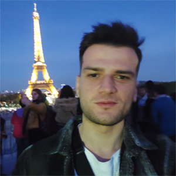

  <html>
  <body>

  
  
   # **Takım İsmi**
   ### **`U-70`**

  # **Oyun İsmi**

  ### **`epiphenom`**

  # Biz Kimiz?

  ## Takım Üyeleri

  <table>
    <tr>
      <th></th>
      <th>İsim</th>
      <th>Rol</th>
      <th>Medya</th>
    </tr>
    <tr>
      <td></td>
      <td>Abdullah Bilal Tekeoğlu</td>
      <td>Scrum Master</td>
      <td>
        
        
        
      </td>
    </tr>
    <tr>
      <td></td>
      <td>Berkan Karademir</td>
      <td>Product Owner</td>
      <td>
        
        
        
      </td>
    </tr>
    <tr>
      <td></td>
      <td>Deniz Kaya</td>
      <td>Developer</td>
      <td>
        
        
        
      </td>
       <tr>
      <td></td>
      <td>Hatice Akgül</td>
      <td>Developer</td>
      <td>
        
        
        
      </td>
         <tr>
      <td></td>
      <td>Mustafa</td>
      <td>Developer</td>
      <td>
        
        
        
      </td>
    </tr>
    <!--
    <tr>
      <td></td>
      <td>Unknown</td>
      <td>Developer</td>
      <td>
        
        
        
      </td>
    </tr>
    <tr>
      <td></td>
      <td>Unknown</td>
      <td>Developer</td>
      <td>
        
        
        
      </td>
    -->
  </tr>
  </table>

  ## Nasıl bir oyun?
  Epiphenom, bir laneti bozmak için karanlık bir dünyaya giren bir kahramanı kontrol eder. Her bölümde, lanetin bir parçasını ortadan kaldırarak ilerler ve sonunda karanlığı tamamen dağıtmak için Lumina'yı yenmelidir.Oyuncunun ışık ve gölgeyi kullanarak bulmacaları çözmesiü ve düşmanlardan kaçması gerekir. Epiphenom, Işık kaynaklarını stratejik olarak kullanıp gölgeler oluşturabilir ve bu gölgeleri platform olarak kullanabilir. Ama gölgeler de sandığın kadar güvenli değil (:

  

    
<h2>Oyun Özellikleri</h2>

  <ul>
  <li>3D</li>
  <li>CO-OP</li>
  <li>Gameanalytics</li>
  </ul>
    
  <h3>Oyun Mekanikleri:</h3>
  <ol>
    <li>Epiphenom ışık kaynaklarını kullanarak kendisine platform oluşturabilir.</li>
    <li>Epi(ışık) karakter bölünerek farklı açılardan ışık oluşturur. Böylece nesnelerden oluşacak gölgelerle enom(gölge) için platform oluşturabilir.</li>
    <li>Epi(ışık) gölge alanlarda kalamaz, kalırsa hasar alır ve zayıflar. Aynı şekilde enom(gölge) aydınlık alanlarda varolamaz.</li>
    <li>Epi(ışık) çevredeki ışık kaynaklarını aşırı yükleyerek bünyesine katabilir ve güçlenebilir. Aşırı yüklenme halinde ulti özelliği aktif olur(kararlaştırılmadı).</li>
    <li>Enom(gölge) etraf ne kadar karanlıksa o kadar güçlüdür. Ortam çok karanlık olduğunda zifir özelliği aktif olur. Böylece karanlığı somutlaştırarak yeni nesneler oluşturabilir.</li>
  </ol>
    
    
  

  

    
<h2>Hedef Kitle</h2>

    
Her yaştan oyuncu kitlesi.

    
Platform oyuncuları.

    
Çiftler.

    
İki kişilik oyun grupları.

  

  --- 

  

  

    
<h1>Sprint 1</h1>

  

    
<h3>Sprint 1 - Sprint Board Update</h3>

    
   

  

    
<h3>Sprint 1 Screenshots</h3>

    

   
    
  

  

  - **Sprint Notları**:
    
    - Proje yönetimi için `Trello` kullanılacak.

    - İletişim `Discord` aracılığıyla sağlanacak.

    - Oyun `URP` modülünde geliştirilecek.

    - Grafik stili `Stylized Realistic` olacak.

    - Oyun `CO-OP` olacak.

  - **Tahmin edilen tamamlanacak puan**: 80 points
  - **Puanlama mantığı**: `(250 puan tamamlanacak.)` İlk sprint için belirlenmiş puan 80'dir.
  - **Daily Scrum Screenshots**: 
  - 
  - 
  -

  - **Product Backlog URL**
    - [Product Backlog URL -> Grup Yetmiş | Trello](https://trello.com/b/3v0my4Jf/grup-yetmi%C5%9F)
     
  - **Sprint Değerlendirmesi:**
  - Oyunun ilk aşamada çift karakter ve tek oyunculu olmasına karar verildi.
    
  - Multiplayer oyun tarzını diğer sprintlerde bir daha gözden geçirme kararı alındı.
    
  - Oyunun dizayan stilinin "stylized realistic" olması kararlaştırıldı

   
    

    

  - **Sprint Değerlendirme Katılımcıları:** `Hatice AKGÜL`, `Abdullah Bilal Tekeoğlu`, `Berkan Karademir `, `Muhammed Mustafa Temel `, `Deniz Kaya`
  
  - **Sprint Retrospective:**
  - Map tasarımı ve karakterlerin tasarımının tamamalanması üzerine yoğunlaşma kararı alındı.

  - Tasarım konusunda Bilal ile birlikte çalışacak bir tasarımcı belirlendi.

  - Karakter hareket ve özellik değiştirme mekanikleri tamamlandı.

  - Takım üyelerinin gelecek sprintlerde daha aktif olması kararı alındı.

 

    
<h1>Sprint 2</h1>

   

    
<h3>Sprint 2 - Sprint Board Update</h3>

  
   

 

    
<h3>Sprint 2 Screenshots</h3>
   
   

   

   

 
 - **Tahmin edilen tamamlanacak puan**: 80 points
- **Puanlama mantığı**: `(250 puan tamamlanacak.)` İkinci sprint için belirlenmiş puan 80'dir.
- **Daily Scrum Screenshots**:
- 
- 
- 
- 
- 
- 
- 
- 
- 
- 
- 
- 
- 
- 
- 
- 
- 

  

- **Product Backlog URL:** https://trello.com/b/TqOzpy5O/u-70-sprint2
- **Sprint Değerlendirmesi:**
- Oyunun ışık karakter özelliğine yoğunlaşma kararı alındı.
  
- Işık toplama mekanikleri tamamlandı.
  
- level dizayn üstünde yoğunlaşıldı.
- **Sprint Değerlendirme Katılımcıları:** `Hatice AKGÜL`, `Abdullah Bilal Tekeoğlu`, `Berkan Karademir `, `Muhammed Mustafa Temel `, `Deniz Kaya`
- **Sprint Retrospective:**
- Map tasarımındaki ve oyunun mantığındaki eksikliklerin giderilmesi kararı alındı.
- Gölge karaktere ağırlık verme kararına varıldı.
- Takım üyelerinin daha aktif olmasına ve daha yoğun çalışma yapılmasına karar verildi.

    
<h1>Sprint 3</h1>

   

    
<h3>Sprint 3 - Sprint Board Update</h3>

